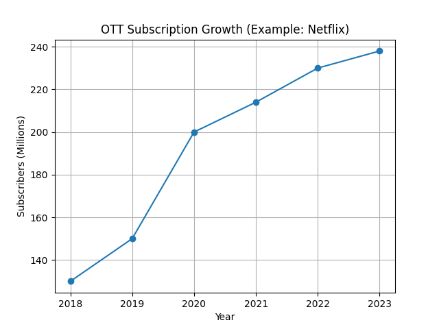
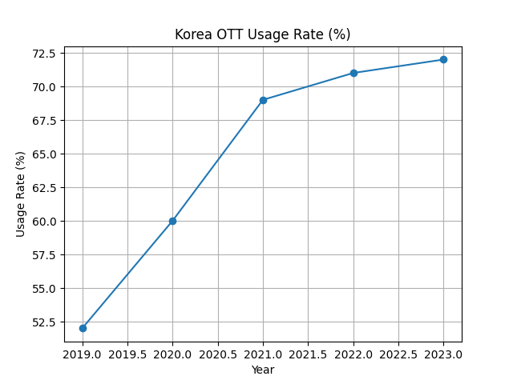
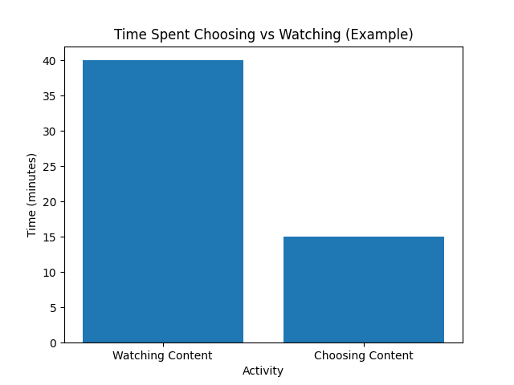
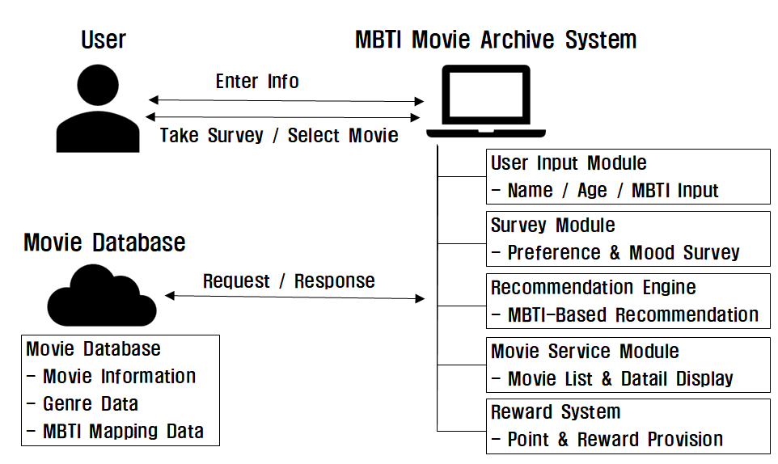

# MBTI Movie Archive

## 1. Conceptualization

| | |
|---|---|
| Student No. | 22212007 |
| Name | 김경인 |
| E-mail | [rlagi03@naver.com](mailto:rlagi03@naver.com) |

---

## [ Revision History ]

| Revision Date | Version # | Description | Author |
|:---:|:---:|---|:---:|
| 03/25/2026 | 1.0.0 | First Documentation | KimGyeongIn 김경인 |
| 03/27/2026 | 1.0.1 | Typo correction and logo creation | KimGyeongIn 김경인 |

---

## = Contents =

1. Business purpose
2. System context diagram
3. Use case list
4. Concept of operation
5. Problem statement
6. Glossary
7. References

---

## 1. Business purpose

### 1) Project background

  
  
  

최근 대중들은 OTT 서비스의 급격한 확산으로 YouTube, Netflix, Disney+와 같은 다양한 플랫폼을 통해 언제 어디서나 수많은 영화 콘텐츠를 접할 수 있게 되었다. 특히 OTT 서비스 가입자는 해가 지날수록 지속적으로 증가하고 있으며, 한국 내 OTT 이용률 또한 꾸준히 상승하고 있다. 이는 현대 사회에서 영상 콘텐츠 소비가 일상화되었음을 보여준다.

그러나 이러한 콘텐츠의 폭발적인 증가와 접근성 향상은 새로운 문제를 야기한다. 사용자들은 수많은 콘텐츠 중에서 무엇을 선택해야 할지 결정하는 데 어려움을 겪고 있으며, 이로 인해 실제 콘텐츠를 시청하는 시간보다 선택에 소비되는 시간이 더 길어지는 현상이 나타나고 있다.

OTT 사용자들은 콘텐츠를 시청하는 시간보다 선택하는 시간이 증가하는 경향을 보이며, 이는 '선택 피로(Decision Fatigue)'로 이어진다. 이러한 현상은 '넷플릭스 증후군'이라는 신조어로도 불리며, 많은 사용자들이 공통적으로 겪는 문제로 자리 잡고 있다.

기존 OTT 플랫폼의 추천 시스템은 주로 시청 기록, 조회수, 인기 순위 등을 기반으로 동작한다. 그러나 이러한 방식은 사용자의 현재 기분이나 성향, 상황에 따른 취향 변화를 충분히 반영하지 못한다는 한계를 가진다. 예를 들어 동일한 사용자라도 상황에 따라 가벼운 영화를 선호할 수도 있고, 감정적으로 몰입할 수 있는 작품을 원할 수도 있지만, 기존 시스템은 이러한 요소를 세밀하게 반영하지 못한다.

이에 따라 본 프로젝트에서는 기존 추천 방식과 차별화된 접근을 시도하고자 한다. 개인의 성격 유형을 나타내는 MBTI를 활용하여 사용자 성향을 보다 직관적으로 반영하고, 이를 기반으로 영화 콘텐츠를 추천하는 시스템인 "MBTI Movie Archive"를 제안한다.

### 2) Goal

- 사용자의 간단한 설문을 통해 MBTI 성향을 분석
- 개인 맞춤형 영화 리스트 제공
- 영화 포스터 및 정보를 시각적으로 제공
- OTT 사용자들의 콘텐츠 선택 부담을 줄이고 만족도 높은 사용 경험 제공

### 3) Target market

- 성향 분석 설문에 높은 관심을 가지고 있고, 영화 및 OTT 콘텐츠 소비 빈도가 높은 20~30대 대학생 및 청년층을 주 대상자로 설정.

---

## 2. System context diagram

사용자는 시스템과 직접 상호작용하는 주체로서, 이름, 나이, MBTI 정보를 입력하고 영화 성향 설문에 참여한다. 이러한 입력 데이터는 시스템 내부로 전달되어 추천 과정의 기초 자료로 활용된다. 또한 사용자는 추천된 영화 목록을 확인하고, 특정 영화를 선택하는 등의 행동을 수행한다.

MBTI Movie Archive System은 전체 서비스의 핵심으로, 여러 기능 모듈로 구성되어 있다. 먼저 User Input Module은 사용자로부터 기본 정보를 입력받고, Survey Module은 사용자의 취향과 감정 상태를 분석한다.

이후 Recommendation Engine은 입력된 MBTI 정보와 설문 결과를 기반으로 개인화된 영화 추천을 생성한다. Movie Service Module은 추천된 영화 목록과 상세 정보를 사용자에게 제공하며, Reward System은 사용자가 영화를 선택했을 때 포인트 등의 보상을 제공하여 사용자 참여를 유도한다.

Movie Database는 영화 정보 및 추천에 필요한 데이터를 저장하는 역할을 한다. 시스템은 추천을 생성하기 위해 영화 데이터, 장르 정보, MBTI 매핑 데이터를 데이터베이스에 요청하고, 데이터베이스는 이에 대한 응답을 반환한다. 이러한 Request/Response 구조를 통해 시스템은 최신 데이터를 기반으로 추천 기능을 수행한다.

---

## 3. Use case list

### 1) Input User Information

| | |
|---|---|
| Actor | User |
| Description | 사용자는 시스템을 이용하기 위해 이름, 나이, MBTI 유형을 입력한다. 회원가입 절차 없이 간단한 정보 입력을 통해 사용자 정보를 설정하며, 입력된 정보는 해당 세션 동안 사용된다. |

### 2) Start Preference Survey

| | |
|---|---|
| Actor | User |
| Description | 사용자는 영화 성향 파악을 위한 설문을 진행한다. 설문은 사용자의 취향, 감정 상태, 선호 장르 등을 파악하기 위한 질문들로 구성되며, 결과는 추천 시스템에 반영된다. |

### 3) Generate Movie Recommendation

| | |
|---|---|
| Actor | User |
| Description | 시스템은 사용자의 MBTI와 설문 결과를 기반으로 맞춤형 영화 추천 리스트를 생성한다. 개인의 성향과 취향을 반영하여 적절한 영화 콘텐츠를 제공한다. |

### 4) View Movie List

| | |
|---|---|
| Actor | User |
| Description | 사용자는 추천된 영화 목록을 확인할 수 있다. 추천 결과는 리스트 형태로 제공되며, 각 영화의 간단한 정보가 함께 표시된다. |

### 5) View Movie Details

| | |
|---|---|
| Actor | User |
| Description | 사용자는 특정 영화를 선택하여 상세 정보를 확인할 수 있다. 영화의 줄거리, 장르, 특징 등의 정보를 제공받는다. |

### 6) Select Movie

| | |
|---|---|
| Actor | User |
| Description | 사용자는 추천된 영화 중 하나를 선택할 수 있다. 선택된 영화는 이후 기능(예: 포인트 지급, 기록 등)에 반영된다. |

### 7) Provide Reward / Point

| | |
|---|---|
| Actor | System |
| Description | 사용자가 영화를 선택하면 시스템은 보상(포인트 등)을 제공한다. 이를 통해 사용자 참여를 유도하고 시스템 이용을 활성화한다. |

### 8) Restart Recommendation

| | |
|---|---|
| Actor | User |
| Description | 사용자는 새로운 추천을 받기 위해 다시 정보를 입력하거나 설문을 재진행할 수 있다. 이를 통해 다양한 상황에 맞는 추천 결과를 얻을 수 있다. |

---

## 4. Concept of operation

### 1) Input User Information

| | |
|---|---|
| Purpose | 사용자의 기본 정보를 입력받아 개인화된 추천의 기준을 마련한다. |
| Approach | 사용자는 이름, 나이, MBTI 유형을 입력한다. 입력된 정보는 별도의 회원가입 없이 세션 기반으로 저장되며, 이후 설문 및 추천 과정에 활용된다. |
| Dynamics | 사용자가 시스템을 처음 실행했을 경우 |
| Goals | 사용자의 기본 성향을 파악하여 맞춤형 추천의 기초 데이터를 확보한다. |

### 2) Start Preference Survey

| | |
|---|---|
| Purpose | 사용자의 영화 취향과 현재 감정 상태를 파악하기 위함이다. |
| Approach | 사용자는 시스템이 제공하는 설문 문항에 응답한다. 설문은 선호 장르, 분위기, 스토리 유형 등 다양한 요소를 포함하며, 결과는 데이터로 분석된다. |
| Dynamics | 사용자가 영화 추천을 받기 위해 설문을 진행하는 경우 |
| Goals | 사용자의 취향을 보다 구체적으로 분석하여 추천 정확도를 높인다. |

### 3) Generate Movie Recommendation

| | |
|---|---|
| Purpose | 사용자의 성향에 맞는 영화 콘텐츠를 제공한다. |
| Approach | 입력된 MBTI 정보와 설문 결과를 종합하여 추천 알고리즘을 통해 영화 리스트를 생성한다. 각 MBTI 유형과 설문 결과에 따라 적합한 영화 데이터를 매칭한다. |
| Dynamics | 사용자가 설문을 완료했을 경우 |
| Goals | 개인 맞춤형 영화 추천을 통해 선택 피로를 줄이고 만족도를 높인다. |

### 4) View Movie List

| | |
|---|---|
| Purpose | 추천된 영화 목록을 사용자에게 제공한다. |
| Approach | 추천 결과를 리스트 형태로 출력하며, 각 영화의 제목, 장르, 간단한 설명을 함께 제공한다. |
| Dynamics | 추천 결과를 확인하고자 하는 경우 |
| Goals | 사용자가 다양한 추천 콘텐츠를 한눈에 확인할 수 있도록 한다. |

### 5) View Movie Details

| | |
|---|---|
| Purpose | 선택한 영화에 대한 상세 정보를 제공한다. |
| Approach | 사용자가 특정 영화를 선택하면 줄거리, 장르, 특징 등의 상세 정보를 화면에 출력한다. |
| Dynamics | 사용자가 특정 영화에 대해 더 자세히 알고 싶은 경우 |
| Goals | 사용자의 선택을 돕기 위한 충분한 정보를 제공한다. |

### 6) Select Movie

| | |
|---|---|
| Purpose | 사용자가 최종적으로 시청할 영화를 선택하도록 한다. |
| Approach | 사용자는 추천 리스트에서 원하는 영화를 선택하며, 선택된 영화는 시스템에 기록된다. |
| Dynamics | 사용자가 추천 목록 중 하나를 선택하는 경우 |
| Goals | 사용자가 콘텐츠 선택을 완료하도록 유도한다. |

### 7) Provide Reward / Point

| | |
|---|---|
| Purpose | 사용자의 참여를 유도하고 시스템 이용을 활성화한다. |
| Approach | 사용자가 영화를 선택하면 시스템은 포인트 또는 보상을 제공한다. |
| Dynamics | 사용자가 영화 선택을 완료한 경우 |
| Goals | 사용자의 지속적인 시스템 이용을 유도한다. |

### 8) Restart Recommendation

| | |
|---|---|
| Purpose | 사용자가 다양한 추천 결과를 다시 받아볼 수 있도록 한다. |
| Approach | 사용자는 새로운 추천을 위해 초기 화면으로 돌아가 정보를 다시 입력하거나 설문을 재진행할 수 있다. |
| Dynamics | 사용자가 다른 추천 결과를 원할 경우 |
| Goals | 반복 사용을 통해 다양한 콘텐츠 탐색을 가능하게 한다. |

---

## 5. Problem statement

### Overview

"MBTI Movie Archive"는 OTT 서비스 이용 과정에서 발생하는 선택 피로 문제를 해결하고, 사용자 성향 기반의 맞춤형 영화 추천을 제공하는 것을 목표로 한다. 기존 추천 시스템이 시청 기록이나 인기 중심으로 동작하는 것과 달리, 본 시스템은 MBTI와 설문 데이터를 활용하여 보다 직관적이고 개인화된 추천을 제공한다.

이를 통해 사용자가 콘텐츠를 선택하는 데 소비하는 시간을 줄이고, 만족도 높은 시청 경험을 제공하고자 한다. 그러나 이러한 목표를 달성하기 위해 고려해야 할 여러 문제들이 존재한다.

### 1) Problem #1 – Recommendation Accuracy

MBTI와 설문을 기반으로 추천을 수행할 경우, 추천의 정확도가 핵심적인 요소가 된다. MBTI는 사용자의 성향을 대표할 수 있지만, 개인의 모든 취향을 완벽하게 반영하지는 못한다. 또한 설문 역시 사용자의 순간적인 선택에 따라 결과가 달라질 수 있다.

따라서 MBTI와 설문 결과를 단순히 매칭하는 방식이 아니라, 다양한 요소를 고려한 추천 로직을 설계해야 한다.

### 2) Problem #2 – Limited User Information

본 시스템은 회원가입 없이 간단한 정보(이름, 나이, MBTI)만을 입력받는 구조이기 때문에 사용자 데이터가 제한적이다. 기존 OTT 플랫폼과 달리 시청 기록이나 행동 데이터를 활용할 수 없기 때문에 추천의 정밀도가 떨어질 가능성이 있다.

이를 보완하기 위해 설문 구조를 효과적으로 설계하고, 적은 정보로도 최대한 정확한 추천이 가능하도록 해야 한다.

### 3) Problem #3 – Survey Fatigue

추천 정확도를 높이기 위해 설문 문항을 늘릴 경우, 사용자에게 부담이 될 수 있다. 설문이 길어질수록 사용자는 흥미를 잃고 이탈할 가능성이 높아진다.

따라서 최소한의 질문으로 최대한의 정보를 얻을 수 있는 효율적인 설문 설계가 필요하다.

### 4) Problem #4 – Data Management

영화 데이터(장르, 분위기, MBTI 매칭 정보 등)를 어떻게 구성하고 관리할 것인지가 중요하다. 추천 시스템의 품질은 데이터의 구조와 정확성에 크게 의존하기 때문에, 영화 데이터를 체계적으로 분류하고 저장해야 한다. 또한 향후 데이터가 증가할 경우에도 효율적으로 관리할 수 있는 구조가 필요하다.

### 5) Problem #5 – System Simplicity vs Functionality

본 프로젝트는 간단한 입력과 직관적인 사용을 목표로 하지만, 기능이 단순할수록 사용자 만족도가 떨어질 수 있다. 반대로 기능을 추가할수록 시스템이 복잡해질 수 있다.

따라서 사용의 간편함과 기능의 다양성 사이에서 적절한 균형을 유지하는 것이 중요하다.

---

## 6. Glossary

| Term | Description |
|---|---|
| User | 시스템을 이용하여 영화 추천을 받는 사용자 |
| MBTI | 개인의 성격 유형을 나타내는 지표로, 영화 추천의 기준으로 사용됨 |
| Survey | 사용자의 영화 취향과 감정 상태를 파악하기 위한 질문 목록 |
| Recommendation System | 사용자 정보를 기반으로 적절한 영화 콘텐츠를 추천하는 시스템 |
| Movie Data | 영화의 제목, 장르, 줄거리, 특징 등의 정보를 포함하는 데이터 |
| Preference | 사용자가 선호하는 영화의 장르, 분위기, 스토리 유형 등 |
| Session | 회원가입 없이 입력된 사용자 정보가 일시적으로 유지되는 상태 |
| Movie List | 추천된 영화들이 리스트 형태로 제공되는 화면 |
| Movie Detail | 선택한 영화의 상세 정보를 보여주는 화면 |
| Selection | 사용자가 추천된 영화 중 하나를 선택하는 행위 |
| Reward / Point | 사용자가 영화를 선택했을 때 제공되는 보상 요소 |
| Survey Result | 설문을 통해 도출된 사용자 취향 분석 결과 |
| Personalization | 사용자 개개인의 성향에 맞춰 콘텐츠를 제공하는 과정 |
| Algorithm | 사용자 데이터와 영화 데이터를 기반으로 추천을 생성하는 로직 |
| Database | 사용자 정보 및 영화 데이터를 저장하고 관리하는 저장소 |

---

## 7. References

- 그래프1 : Netflix Investor Relations (IR) 자료를 바탕으로 재구성.
- 그래프2 : 한국콘텐츠진흥원 및 방송통신위원회 통계 자료(2023)를 바탕으로 재구성.
- 그래프3 : Choice Overload / Decision Fatigue 관련 연구
